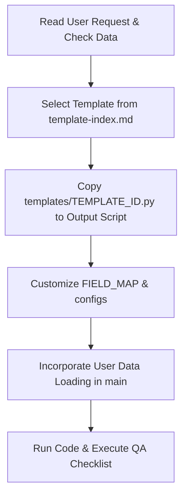

# Workflow: Scientific Plotting Procedures

This document outlines the three primary workflows for generating, refactoring, and optimizing scientific plots using the `rk_plotter` template skill.

---

## Workflow A: Drawing From Scratch
Use this workflow when the user provides raw data, schema, or descriptions but has no existing plotting code.

### Execution Steps
1. **Analyze Requirements**: Understand the scientific query (e.g. model validation, time series scenario, composition projection).
2. **Inspect Data Structure**: Understand the variables, value ranges, presence of dates/times, spatial coordinates, and administrative region names.
3. **Select Template**: Consult `references/template-index.md` to find the template matching the scientific data and layout requirements.
4. **Copy Template Boilerplate**: Read the selected script from `templates/TEMPLATE_ID.py` and copy its exact text structure.
5. **Configure Parameters**:
   - Update `FIELD_MAP` with the user's actual DataFrame columns.
   - Update `TEXT_CONFIG` (title, labels, units, legends).
   - Update `STYLE_CONFIG` (figsize, font size, colors, widths).
   - Update `EXPORT_CONFIG` (basename, formats like pdf/svg/png, resolution).
6. **Customize Data Loading**: Replace the mock dataset generation in `load_data()` or `main()` with the user's real file reading logic.
7. **Verify & QA**: Run the script and execute the `qa-checklist.md`.

---

## Workflow B: Refactoring Existing Code
Use this workflow when the user has an existing plotting script that works but lacks publication-quality aesthetics, suffers from code bloat, or requires layout restructuring.

### Execution Steps
1. **Analyze the Input Code**: Identify what parts load/clean/analyze data versus what parts draw the figure.
2. **Partition the Script**:
   - **DATA BLOCK**: Keep intact. This includes file reading, cleaning, filtering, interpolation, regressions, and statistical tests.
   - **PLOT BLOCK**: Delete. This includes subplots creation, plotting loops, text annotations, legends, colorbars, grids, ticks, and file saves.
3. **Find the Matching Template**: Select the corresponding template from `template-index.md` that matches the old script's chart type.
4. **Merge and Rewrite**:
   - Create a clean script based on the template's structure.
   - Insert the legacy **DATA BLOCK** inside the new script's data loading or preprocessing functions.
   - Map the final data variables (Series, NumPy arrays, or DataFrames) to the template's standard `FIELD_MAP` or `prepare_data()` interface.
   - Replace the legacy plotting block entirely with the template's standardized `plot()` function.
5. **Adjust Styles and Text**: Set appropriate configs for publication formats.
6. **Verify & QA**: Execute the script and run the QA checklist.

---

## Workflow C: Optimizing Existing Plots
Use this workflow when the user's existing plot is structurally sound and they only request styling improvements (colors, fonts, dimensions, alignment, text).

### Execution Steps
1. **Identify the Style Target**: Determine the target journal specifications (e.g., Nature single-column, double-column, or standard HSL color palettes).
2. **Define Edit Boundaries**: Consult `edit-boundary.md` to confirm what properties can be changed.
3. **Apply the Style Contract**:
   - Keep the original data processing and the core plot structure (do not change scatter to bar, do not delete panels, etc.).
   - Re-write matplotlib settings to use the `style-contract.md` specifications (e.g., Arial/DejaVu fonts, `svg.fonttype = "none"`, `pdf.fonttype = 42`).
   - Standardize line widths, scatter sizes, color cycles, border widths, grids, and legend spacing.
   - Replace manual/hardcoded file exports with the template's standardized `save_outputs()` logic.
4. **Verify & QA**: Save outputs and check the file size and font editability.
